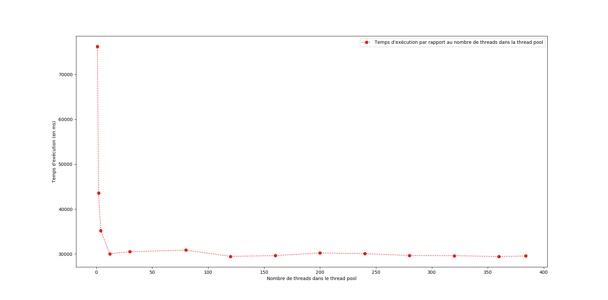

# multicore-project
Projet de programmation multicoeur - Master 1 ALMA 

## Pour exécuter le projet :
	* $ mvn clean compile exec:java

## Résultats obtenus :

#### Paramètres du set : 
	* x_min = -2.25; y_min = -1; x_max = 0.75; y_max = 1; // Full Mandelbrot set
	* x_definition = 1200;
	* y_definition = 800;
	* block_size = 50;

#### Temps d'exécution :
	1 thread    -> 76217 ms
	2 threads   -> 43581 ms 
	4 threads   -> 35231 ms
	12 threads  -> 30043 ms
	30 threads  -> 30501 ms 
	80 threads  -> 30866 ms
	120 threads -> 29466 ms
	160 threads -> 29637 ms
	200 threads -> 30234 ms 
	240 threads -> 30072 ms 
	280 threads -> 29656 ms
	320 threads -> 29619 ms
	360 threads -> 29437 ms
	384 threads -> 29549 ms

#### Affichage des résultats :

#### Analyse des résultats :
	Le speedup atteint par rapport à une exécution avec un seul thread est de plus de 2,5. En revanche il est très rapidement atteint vers 12 threads. En instanciant plus de threads dans la thread pool, on ne gagne pas une accélération du temps d'exécution suffisamment visible. En revanche, le temps d'instanciation de l'objet Server qui contient la thread pool est bien plus élevé. De plus, l'instanciation d'un très grand nombre de threads (un par bloc par exemple) entraîne une surcharge importante de la mémoire. On peut donc en déduire qu'il existe un seuil à partir duquel il n'est plus intéressant d'instancier plus de threads dans la thread pool (ici autour de 12 threads).